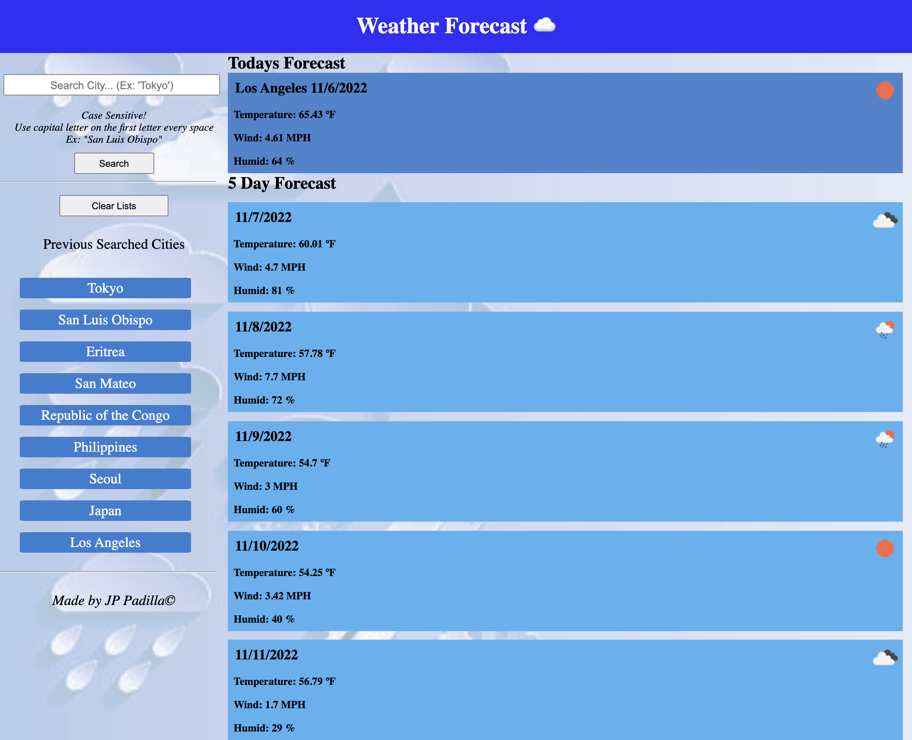

# Weather Patrol 0.1

## Description

This website contains a title called "Weather Forecast ☁️". On the left side if the webpage includes a search bar that allows user to search for cities and checkout todays forecast and 5 day future forecast of the seached city. This also allows user to save previous searches and is able to be clicks will show corresponding weather forecast with the 5 day future forecast as well. In the side bar menu, user may also clear searched city history to start over. 

## Usage

This app can be use to see current day weather and as well as 5 day future forecast according to the city you want to visit or just curious about. This app is designed for people who travels alot or just curious what the weather is gonna be like., with the capability of saving previous searches that is both user friendly and convenient. 

## URL

https://junnel308.github.io/weather-patrol-0.1/

## Screenshots

## Credits

Robert Wijtman (Instructor), AskABC, Bootcamp Modules, w3schools.com, stackoverflow.com, Minjoo Park. 

## License

MIT License

Copyright (c) 2022 JP Padilla

Permission is hereby granted, free of charge, to any person obtaining a copy
of this software and associated documentation files (the "Software"), to deal
in the Software without restriction, including without limitation the rights
to use, copy, modify, merge, publish, distribute, sublicense, and/or sell
copies of the Software, and to permit persons to whom the Software is
furnished to do so, subject to the following conditions:

The above copyright notice and this permission notice shall be included in all
copies or substantial portions of the Software.

THE SOFTWARE IS PROVIDED "AS IS", WITHOUT WARRANTY OF ANY KIND, EXPRESS OR
IMPLIED, INCLUDING BUT NOT LIMITED TO THE WARRANTIES OF MERCHANTABILITY,
FITNESS FOR A PARTICULAR PURPOSE AND NONINFRINGEMENT. IN NO EVENT SHALL THE
AUTHORS OR COPYRIGHT HOLDERS BE LIABLE FOR ANY CLAIM, DAMAGES OR OTHER
LIABILITY, WHETHER IN AN ACTION OF CONTRACT, TORT OR OTHERWISE, ARISING FROM,
OUT OF OR IN CONNECTION WITH THE SOFTWARE OR THE USE OR OTHER DEALINGS IN THE
SOFTWARE.
